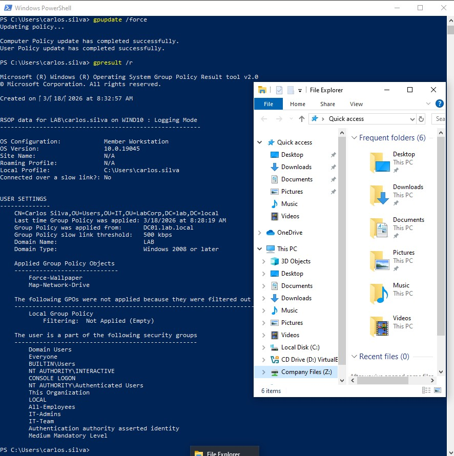
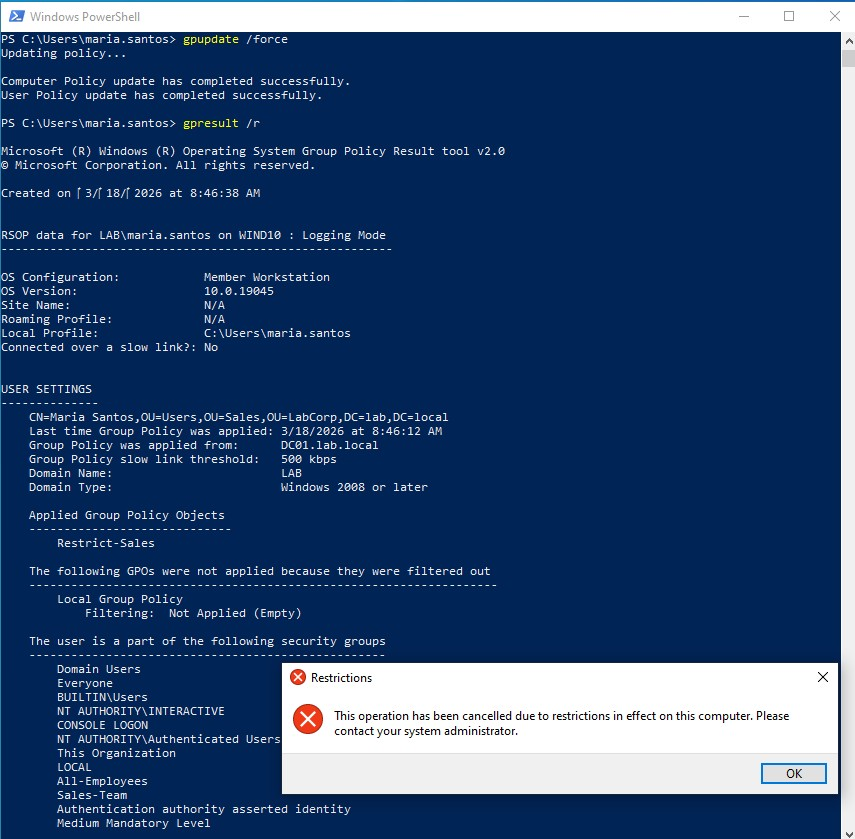

# Active Directory - Group Policy Objects (GPO)

## Purpose

Learn how to manage users and computer centrally using **Group Policy** - one of the most powerful features of Active Directory. with GPOs, you can control everything from desktop wallpapers to security settings across your entire domain.

## Prerequisites

- Domain Controller installed and running (`DC01` with `lab.local`)
- Organizational Units created (e.g., `IT`, `Sales`, `HR`)
- Domain users created (e.g., `carlos.silva` in IT, `maria.santos` in Sales)
- Windows 10 client joined to the domain

---

## 1. What are Group Policies?

**Group Policy** is like a **remote control** for all computers and users in your domain.

Instead of configuring each computer manually, you define settings once in a GPO, and Active Directory ensures every computer/user in the target OU receives those settings.

### Common uses:
- 🖼️ **Force wallpaper** on company computers
- 📁 **Map network drives** automatically
- 🔒 **Restrict Control Panel access** for certain users
- 🔐 **Enforce password policies** and security settings
- 📜 **Run scripts** at startup/login

---

## 2. Creating Test Resources on the DC

Before creating GPOs, let's prepare the resources they'll use.

### Step 2.1: Create a shared folder for wallpapers

On `DC01`, open PowerShell as Administrator:

```powershell
# Create folder for wallpapers
New-Item -Path "C:\Public\Wallpapers" -ItemType Directory

# Copy a wallpaper image to this folder (name it wallpaper.jpg)
# You can use any JPG image - copy it manually or download one

# Share the folder
New-SmbShare -Name "Wallpapers" -Path "C:\Public\Wallpapers" -ChangeAccess "Everyone"
```

## Step 2.2: Create a shared folder for network drives
```powershell
# Create company files folder
New-Item -Path "C:\Shared" -ItemType Directory

# Share it
New-SmbShare -Name "Shared" -Path "C:\Shared" -ChangeAccess "Everyone"
```

## 3. Creating Group Policy Objects

### Step 3.1: Open Group Policy Management

1. On `DC01`, open **Server Manager**
2. Click **Tools** -> **Group Policy Management**
3. Expand `Forest: lab.local` -> `Domains` -> `lab.local`

### Step 3.2: Create the first GPO - Force Wallpaper

1. Right-click **Group Policy Objects** -> **New**
2. **Name:** `Force-Wallpaper`
3. Click **OK**
4. Right-click the new GPO -> **Edit**

**Configure the policy:**

- Navigate to: `User Configuration` -> `Policies` -> `Administrative Templates` -> `Desktop` -> `Desktop`
- Find: **"Desktop Wallpaper"**
- Double-click -> **Enabled**
- **Wallpaper Name:** `\\dc01.lab.local\Wallpapers\wallpaper.jpg`
- **Wallpaper Style:** `Fill`
- Click **OK**
- Close the Group Policy Management Editor

### Step 3.3:Create the second GPO - Map Network Drive

1. Right-click **Group Policy Objects** -> **New**
2. **Name:** `Map-Network-Drive`
3. Click **OK**
4. Right-click the new GPO -> **Edit**

**Configure the policy:**
- Navigate to: `User Configuration` -> `Preferences` -> `Windows Settings` -> `Drive Maps`
- Right-click **Drive Maps** -> **New** -> **Mapped Drive**
- **Action:** `Create`
- **Location:** `\\dc01.lab.local\Shared`
- **Drive Letter:** `Z:`
- **Label:** `Company Files`
- Click **OK**
- Close The Group Policy Management Editor

### Step 3.4: Create the third GPO - Restrict Control Panel

1. Right-click **Group Policy Objects** -> **New**
2. **Name:** `Restrict-Sales`
3. Click **OK**
4. Right-click the new GPO -> **Edit**

**Configure the policy:**
- Navigate to: `User Configuration` -> `Policies` -> `Administrative Templates` -> `Control Panel`
- Find: **"Prohibit access to Control Panel and PC settings"**
- Double-click -> **Enabled**
- Click **OK**
- Close the Group Policy Management Editor

---

## 4. Linking GPOs to Organizational Units

Now we connect each GPO to the OU where it should apply.

### Step 4.1: Link wallpapers and drive maps to IT

1. In **Group Policy Management**, navigate to `lab.local` -> `LabCorp` -> `IT`
2. Right-click **IT** -> **Link an Existing GPO...**
3. Select `Force-Wallpaper` -> **OK**
4. Repeat: Link `Map-Network-Drive` to **IT**

### Step 4.2: Link Control Panel restriction to Sales

1. Navigate to `lab.local` -> `LabCorp` -> `Sales`
2. Right-click **Sales** -> **Link an Existing GPO...**
3. Select `Restrict-Sales` -> **OK**

---

## 5. Testing the Policies 🧪

### Test 1: Login as IT user (`carlos.silva`)

On the Windows 10 client, log in with `LAB\carlos.silva`.

Open **PowerShell**:
```powershell
# Force immediate policy update
gpupdate /force

# Check applied policies
gpresult /r
```

**Expected output:**
```text
Applied Group Policy Objects
-----------------------------
    Force-Wallpaper
    Map-Network-Drive
```



*Figure: Verifying GPO application for user carlos.silva*

**What you're seeing:**
**Left (PowerShell - gpresult /r):**
- **Force-Wallpaper** GPO applied
- **Map-Network-Drive** GPO applied
- User is member of: `IT-Team`, `All-Employees`, `IT-Admins`
- Policy applied from: `DC01.lab.local`
- Last applied: 3/18/2026 at 8:28:19 AM

**Right (File Explorer):**
- **Company Files (Z:)** drive automatically mapped
- Network share `\\dc01.lab.local\Shared` accessible
- Drive appears in "This PC" under "Network Locations"

### Test 2: Login as Sales user (`maria.santos`)

Log out and log in with `LAB\maria.santos`.

```powershell
gpupdate /force
gpresult /r
```

**Expected output:**
```
Applied Group Policy Objects
-----------------------------
    Restrict-Sales
```



*Figure: Verifying GPO application for user maria.santos - Restrict-Sales policy blocking access*

**What you're seeing:**

**PowerShell (gpresult /r):**
- **Restrict-Sales** GPO applied successfully
- User: `LAB\maria.santos` in `OU=Sales,OU=LabCorp,DC=lab,DC=local`
- Policy applied from: `DC01.lab.local`
- Last applied: 3/18/2026 at 8:46:12 AM
- Member of: `Sales-Team`, `All-Employees`

**Popup Dialog:**
- 🔒 **"This operation has been cancelled due to restrictions in effect on this computer"**
- This confirms the **Restrict-Sales** GPO is working - Control Panel access is blocked!

---

## 6. Understanding GPO Processing

### How GPOs are applied:

1. **Local** -> Computer's local policies
2. **Site** -> Policies linked to the AD site
3. **Domain** -> Policies linked to the domain
4. **OU** -> Policies linked to OUs (from parent to child)
5. **Last applied wins** if there are conflicts

### Important Concepts:

| Concept | Description | Example | 
| - | - | - |
| **Linking** | Attaching a GPO to an OU (or domain, site) | Link `Force-Wallpaper` to `IT` OU |
| **Enforced** | Forces a GPO to override all others (no-block) | Domain-level security policies |
| **Block Inheritance** | Prevents parent OUs from applying policies | Test OU with custom settings |
| **Security Filtering** | Limits GPO to specific users/groups | Apply only to `IT-Admins` |
| **WMI Filtering** | Limits GPO to computers matching criteria | Windows 10 only, specific RAM |

---

## 7. Advanced Security Filtering

By default, GPOs apply to **Authenticated Users** in the linked OU. You can restrict them to specific groups.

**Example:** Make `Map-Network-Drive` apply to ALL employees (not just IT):

1. In **Group Policy Management**, select `Map-Network-Drive`
2. Go to the **Scope** tab
3. Under **Security Filtering**, remove `Authenticated Users`
4. Click **Add** -> type `All-Employees` -> **OK**
5. Now the GPO applies to anyone in the `All-Employees` group, regardless of OU

This is called **group nesting** - very powerful!

---

## 8. Common Issues & Solutions

### Issue: GPO not applying
Check:
- Is the GPO linked to the correct OU?
- Is the user/computer in that OU?
- Run gpresult /r to see applied policies
- Run gpupdate /force to force update

### Issue: Changes not appearing
- GPOs refresh every 90-120 minutes by default
- Use gpupdate /force for immediate update
- Some settings (like wallpaper) may need logoff/logon

### Issue: Conflicting policies
- Use gpresult /r to see all applied policies
- Last applied policy wins
- Check for Enforced or Block Inheritance settings

### Backup of GPOs (Best Practice)
```powershell
# Backup of all GPOs
Backup-GPO -All -Path "C:\GPO-Backups"

# Backup of a specific GPO
Backup-GPO -Name "Force-Wallpaper" -Path "C:\GPO-Backups"
```

### GPO Troubleshooting Flow 🔍

```text
GPO not applying?
├─→ Run gpresult /r → Is GPO listed?
│ ├─ Yes → Check if settings need logoff/reboot
│ └─ No → Check OU link and Security Filtering
├─→ Check gpresult /h report.html for detailed info
└─→ Verify network connectivity to DC
```

--- 

## 9. Key Concepts to Remember:

- **GPOs are applied to OUs**, not individual users
- **Order matters** - last applied policy wins
- **Security Filtering** controls who gets the policy
- `gpresult /r` is your best friend for troubleshooting
- **Reboot/logoff** may be needed for some settings

---

## 10. Next Steps 🚀

Now that you can manage settings with GPOs, it's time to monitor what happens:

| Document | What you'll do |
| - | - |
| [`ad-integration-wazuh.md`](./ad-integration-wazuh.md) | Monitor AD events (user creation, logins) with Wazuh |
| [`ad-troubleshooting.md`](./ad-troubleshooting.md) | Document other AD issues you encounter |