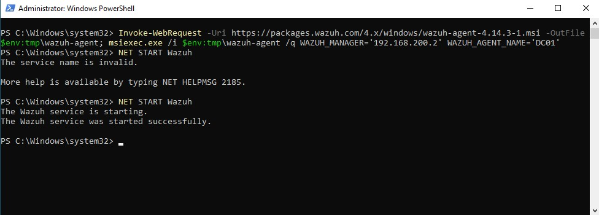
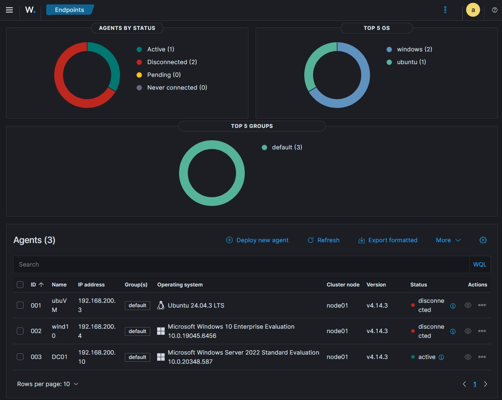
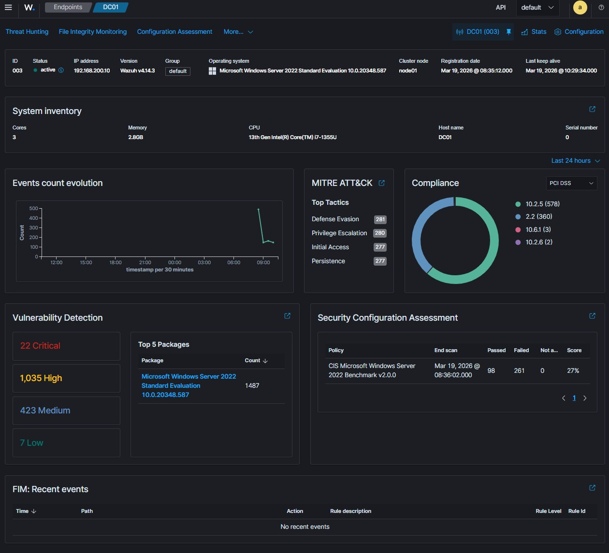
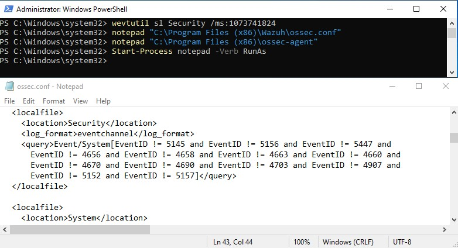
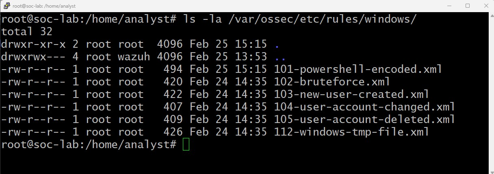
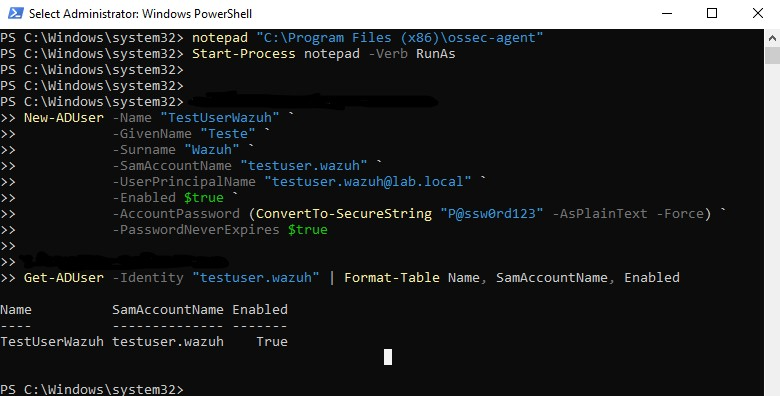
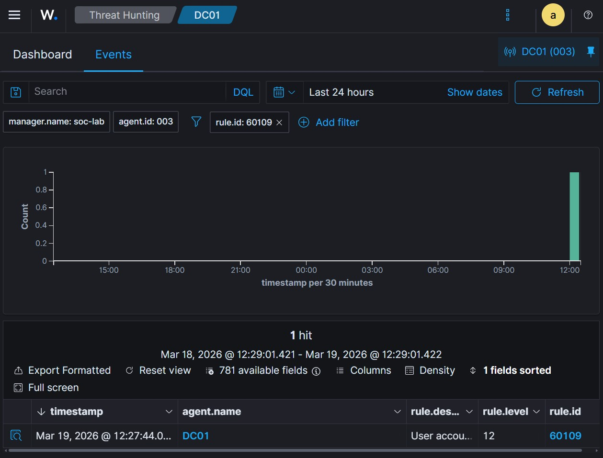

# Active Directory - Wazuh Integration

## Purpose

Learn how to monitor Active Directory security events using Wazuh SIEM. This guide covers forwarding Windows Event Logs from the Domain Controller to Wazuh and creating custom detection rules.

## Prerequisites

- Domain Controller installed and running (`DC01`)
- Wazuh server running (indexer, manager, dashboard)
- Network connectivity between DC01 and Wazuh server
- Wazuh agent installed on DC01

---

## 1. Why Monitor AD?

Active Directory is the **crown jewels** of any Windows network. Attackers target AD because:

- Compromising AD = compromising everything
- Common attacks: Pass-the-Hash, Kerberoasting, DCSync
- Need to detect: New users, privilege escalation, anomalous logins

---

## 2. Install Wazuh Agent on DC01

### Step 2.1: Generate Agent Deployment Command

1. On the **Wazuh Dashboard**, click the **hamburger menu** (☰) on the top left
2. Navigate: **Agent management** -> **Summary**
3. On the Summary page, click **"Deploy new agent"**
4. You'll be redirected to the agent configuration page

### Step 2.2: Fill in Agent Details

| Field | Value |
| - | - |
| **Server address** | `192.168.200.2` (Wazuh server IP) |
| **Agent name** | `DC01` |
| **Operating system** | `Windows` |
| **Group** | (default is fine, or Create "Domain Controllers") |

### Step 2.3: Get Installation Command

Wazuh will generate a command like:

```powershell
Invoke-WebRequest -Uri https://packages.wazuh.com/4.x/windows/wazuh-agent-4.14.3-1.msi -OutFile $env:tmp\wazuh-agent; msiexec.exe /i $env:tmp\wazuh-agent /q WAZUH_MANAGER='192.168.200.2' WAZUH_AGENT_NAME='DC01' 
```

> Copy the command in the Wazuh Dashboard.

### 2.4: Install on DCO01 and Start the Agent Service

On `DC01`, open PowerShell as Administrator and run the generated command.


*Figure: Downloading, installing, and starting the Wazuh agent on the Domain Controller*

**What you're seeing:**
- Agent downloaded to `$env:tmp\wazuh-agent`
- Silent installation with `msiexec.exe`
- Configured with Wazuh manager IP: `192.168.200.2`
- Agent name: `DC01`
- Service started successfully

Wazuh will also give you the command to start the Agent Service, should be something like this:

```powershell
NET START Wazuh
```

> **Note**: If you get "The service name is invalid", try `NET START "Wazuh Agent"` or check if the installation completed successfully. In the image you can see my first attempt **didn't** work, but then I waited 5 seconds and tried again and it worked.

### Step 2.5: Verify Agent Connection

Back in the **Wazuh Dashboard**, navigate to:

**Agent management** -> **Summary**

You should see `DC01` with status **Active** (green dot).



*Figure: Wazuh Agents dashboard showing DC01 (active), wind10 and ubuVM (disconnected)*

**What you're seeing:**
- ✅ **DC01** (ID 003) - Status: **Active** 
- 🖥️ OS: Microsoft Windows Server 2022 Standard Evaluation
- 🌐 IP: 192.168.200.10
- 📦 Version: v4.14.3

✅ **Success!** The Domain Controller is now sending events to Wazuh.

### Step 2.6: Explore Agent Details

Click on the **DC01** agent to see detailed information:



*Figure: DC01 detailed dashboard - Full endpoint visibility*

**What this dashboard shows:**

**Top Section:**
- ✅ Agent status: **Active** (real-time)
- 🖥️ System inventory: 3 cores, 2.8GB RAM, Intel i7-1355U
- 📊 Events count evolution (last 24h)
- 🎯 MITRE ATT&CK tactics detected

**Security Insights:**
- 🚨 **Vulnerability Detection**: 22 Critical, 1,035 High, 423 Medium
- 🔒 **Security Configuration Assessment**: CIS Benchmark score 27% (261 failed checks)
- 📋 **Compliance**: PCI DSS status
- 📁 **FIM**: File Integrity Monitoring (no recent events yet)

> 💡 **Why this matters:** This single view gives you complete visibility into your Domain Controller's security posture - exactly what a SOC needs!

---

## 3. Configure Windows Event Log Forwarding

### 3.1: Enable Required Windows Event Logs

On `DC01`, open **PowerShell as Administrator** and run:
```powershell
# Check if Security Log is enabled
wevtutil gl Security | Select-String "enabled"

# Set maximum log size to 1GB (recommended for labs)
wevtutil sl Security /ms:1073741824
```

---

### 3.2: Verify Wazuh Agent Configuration

The Wazuh agent on `DC01` already includes Security Log collection by default.
Check The configuration file:
```powershell
notepad "C:\Program Files (x86)\ossec-agent\ossec.conf"
```

**Opening the file (with admin privileges):**

```powershell
# This won't work either - permission denied even as admin
notepad "C:\Program Files (x86)\ossec-agent\ossec.conf"

# ✅ This works - opens Notepad as Administrator
Start-Process notepad -Verb RunAs
```

> 💡 Why? Even running PowerShell as Administrator, opening files in Program Files (x86) requires elevated privileges. Start-Process notepad -Verb RunAs opens an elevated Notepad, then navigate to the file manually.


*Figure: Viewing ossec.conf to verify Security Log configuration*

---

### 3.3: Verify Security Log Configuration
In `ossec.conf`, look for the `<localfile>` section for Security logs:
```xml
<localfile>
  <location>Security</location>
  <log_format>eventchannel</log_format>
  <query>Event/System[EventID != 5145 and EventID != 5156 and EventID != 5447 and
    EventID != 4656 and EventID != 4658 and EventID != 4663 and EventID != 4660 and
    EventID != 4670 and EventID != 4690 and EventID != 4703 and EventID != 4907 and
    EventID != 5152 and EventID != 5157]</query>
</localfile>
```

> Good news: The configuration is already correct! No changes needed.

**What this configuration does:**
| Element | Purpose |
| - | - |
| `<location>Security</location>` | Monitors the Windows Security Event Log| 
| `<log_format>eventchannel</log_format>` | Uses Windows Event Channel API (efficient) |
| `<query>` | Filters out noisy/irrelevant Event IDs |

**Filtered Event IDs (excluded):**
- `5145, 5156, 5447` - Network/share access (too verbose)
- `4656, 4658, 4663, 4660` - Object access/handles (high volume)
- `4670, 4690, 4703, 4907` - Permission changes (can be noisy)
- `5152, 5157` - Windows Filtering Platform events

> 🎯 Why filter? The Security Log generates thousands of events daily. Filtering reduces noise and focuses on security-relevant events like user creation (4720), logon attempts (4624/4625), and privilege changes (4732).

> **No restart needed** - The configuration was already correct. The agent is actively collecting Security Events!

---

## 4. Create Custom Wazuh Rules

### Step 4.1: Understanding Wazuh Rules Structure

Wazuh uses XML rules to detect specific events. Each rule has:

- **ID**: Unique identifier
- **Level**: Alert severity (1-15)
- **Description**: What the rule detects
- **MITRE mapping**: ATT&CK technique reference

### Step 4.2: Locate Custom Rules Directory

On your **Wazuh server** (`192.168.200.2`), the custom rules for this lab are already created:
```bash
# List custom Windows AD rules
ls -la /var/ossec/etc/rules/windows/
``` 

*Figure: Custom Windows AD detection rules in /var/ossec/etc/rules/windows/*

**What you're seeing**:
- 📁 **Directory**: /var/ossec/etc/rules/windows/
- 📄 **Rule files** (XML format):
    - `101-powershell-encoded.xml` - Detects encoded PowerShell commands
    - `102-bruteforce.xml` - Detects brute-force login attempts
    - `103-new-user-created.xml` - Detects new AD user creation
    - `104-user-account-changed.xml` - Detects account modifications
    - `105-user-account-deleted.xml` - Detects user deletion
    - `12-windows-tmp-file.xml` - Detects suspicious temp file execution
- 🔢 **Numbering**: Rules are numbered sequentially (easy to manage)
- 👤 **Owner**: `root:root` with read permissions

### Step 4.3: Understanding Rule 103 - User Created

#### Understanding Rule Dependencies

The custom rule `103-new-user-created.xml` builds upon Wazuh's native rules: [`103-new-user-created.xml`](./monitoring/wazuh-rules/windows/103-new-user-created.xml)

```xml
<!-- 103-new-user-created  -->

<group name="local,account_management,">
  <rule id="60109" level="12" overwrite="yes">
    <if_sid>60103</if_sid>
    <field name="win.system.eventID">^4720$</field>
    <description>User account created - elevated severity for SOC-Lab (filtered)</description>
    <group>account_management,suspicious_activity,</group>
    <mitre>
      <id>T1136.001</id>
    </mitre>
  </rule>
</group>
```

This rule builds upon Wazuh's native rules:

```text
Native rule 60103 (level 0) -> Native rule 60109 (level 8) -> Custom rule 60109 (level 12)
```

| Rule ID | Level | Description | Source |
|---------|-------|-------------|--------|
| `60103` | 0 | Base audit success events | Wazuh native |
| `60109` | 8 | User enabled/created (multiple Event IDs) | Wazuh native |
| `60109` | 12 | **Custom:** User creation (Event ID 4720) only | Your lab |

> 🔍 **Why `overwrite="yes"`?** This tells Wazuh to replace the native rule with our custom version. The original rule (level 8) detected multiple events; ours focuses only on user creation and raises the severity to level 12.

---

## 5. Test Detection Scenarios

### Step 5.1: Test User Creation

On `DC01`, create a test user:

```powershell
New-ADUser -Name "TestUserWazuh" `
           -GivenName "Teste" `
           -Surname "Wazuh" `
           -SamAccountName "testuser.wazuh" `
           -UserPrincipalName "testuser.wazuh@lab.local" `
           -Enabled $true `
           -AccountPassword (ConvertTo-SecureString "P@ssw0rd123" -AsPlainText -Force) `
           -PasswordNeverExpires $true

# Verify user was created
Get-ADUser -Identity "testuser.wazuh" | Format-Table Name, SamAccountName, Enabled
```


*Figure: Creating a test user in AD to trigger detection*

### Step 5.2: Verify Alert in Wazuh Dashboard

1. In **Wazuh Dashboard**, go to **Agents management** → **Summary** → **DC01** → **Threat Hunting** → **Events**
2. Click add filter:
  - Field: `rule.id`
  - Operator: `is`
  - Value: `60109`
  - Finish with `Save`
3. You should see an alert with level 12:


*Figure: Wazuh alert showing user creation detected with custom rule 60109*

**Alert details:**
- **Rule ID:** `60109`
- **Level:** `12`
- **Description:** "User account created - elevated severity for SOC-Lab (filtered)"
- **Agent name:** `DC01`

✅ **Success!** The custom rule is working and generating high-severity alerts.

---

## 6. Verification

- Wazuh agent installed and active on DC01
- Security logs being forwarded (visible in dashboard)
- Custom rules copied to `/var/ossec/etc/rules/`
  - this folder should be active to Wazuh search this rules
- Wazuh manager restarted after adding rules
  - run command to confirm if rule is valid: `/var/ossec/bin/wazuh-analysisd -t`
- User creation triggers alert (rule 60109)
- Alert severity reflects custom levels

---

## 7. What You've Learned

- How to install and configure Wazuh agent on a Domain Controller
- How Windows Event Logs are forwarded to Wazuh
- How Wazuh rules are structured and how they inherit from native rules
- The importance of `overwrite="yes"` for customizing existing rules
- How to test detection rules by simulating AD events
- How to verify alerts in the Wazuh dashboard

---

## 8. Next Steps 🚀

| Document | What you'll do |
|----------|----------------|
| [`ad-troubleshooting.md`](./ad-troubleshooting.md) | Document common AD/Wazuh issues |
| [`ad-group-policy.md`](./ad-group-policy.md) | Apply GPOs and monitor changes |
| Return to [Home SOC Lab](../README.md) | Explore other lab areas |