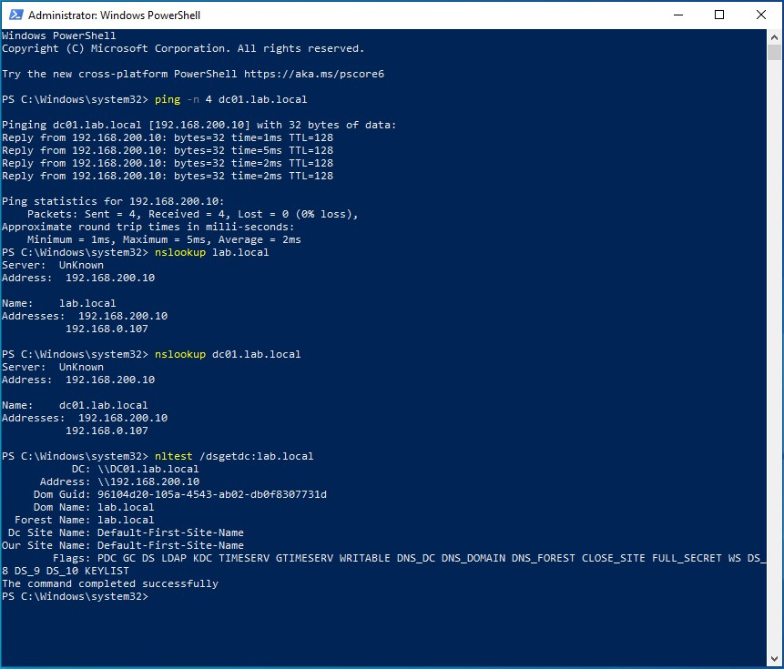
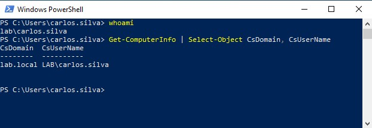
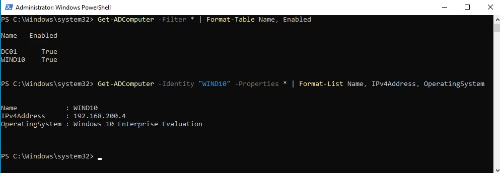

# Active Directory - Join Windows 10 Client to Domain

## Purpose

Learn how to connect a Windows 10 machine to your Active Directory domain, allowing users to log in with their domain credentials and access centralized resources.

## Prerequisites

- ✅ Domain Controller installed and running (`DC01` with `lab.local`)
- ✅ Windows 10 VM created and network configured
- ✅ DNS on Windows 10 pointing to the DC (`192.168.200.10`)
- ✅ Domain user account created (e.g., `carlos.silva`)

---

## 1. Verify Connectivity to the Domain Controller

Before joining the domain, confirm the client can reach the DC:

--- 

## 1. Verify Connectivity to the Domain Controller

Before joining the domain, confirm the client can reach the DC:

```powershell
# Test network connectivity 
ping -n 4 dc01.lab.local

# Test DNS resolution
nslookup lab.local
nslookup dc01.lab.local

# Test DC discovery
nltest /dsgetdc:lab.local
```

### Expected output:


*Figure: Testing domain controller connectivity and DNS resolution*

**What we're testing:**
- **ping dc01.lab.local** -> Network connectivity to DC
- **nslookup lab.local** -> DNS resolution for domain
- **nslookup dc01.lab.local** -> DNS resolution for DC hostname
- **nltest /dsgetdc:lab.local** -> Verify DC services and site information

✅ All commands should return the DC IP (192.168.200.10 in this example)

> **Troubleshooting:** if ping fails, check firewall rules on the DC. If DNS fails, verify the client's DNS settings point to `192.168.200.10`.

---

## 2. Join the Domain 🌐

### Step 2.1: Open System Properties

1. Open **File Explorer**
2. Right-click "**This PC**" -> **"Properties"**
3. Click **"Advanced system settings"** (left sidebar)
4. Go to **"Computer Name"** tab
5. Click **"Change..."**

### Step 2.2: Change domain membership

1. Under **"Member of"**, select **"Domain"**
2. Type: `lab.local`
3. Click **OK**

### Step 2.3: Authenticate

A window will ask for credentials:
- **Username**: `LAB\administrator` (or any domain admin)
- **Password**: [your admin password]

### 2.4: Welcome message

You should see:
```text
Welcome to the lab.local domain.
```

Click **OK** -> **Close** -> **Restart Now**

---

## 3. First Login with Domain User 👤

After reboot:
1. At the login screen, you may see **"Sign in to: LAB"** (or use "Other user")
2. **Username:** `carlos.silva` (or `LAB\carlos.silva`)
3. **Password:** [user's password]

Windows will display **"Preparing Windows"** - this is the system creating a local profile for the domain user.
> **What's happening?** The first time a domain user logs in, Windows creates a local profile (in `C:\Users\carlos.silva`) that will persist for future logins.

---

## 4. Verification

### On the Windows 10 client:

```powershell
# Check who you are
whoami
# Should show: lab\carlos.silva

# Verify domain membership
Get-ComputerInfo | Select-Object CsDomain, CsUserName
```


*Figure: Confirming domain membership and current user context*

**What you're seeing:**
- **whoami** -> Shows `lab\carlos.silva` (domain\username format)
- **CsDomain** -> `lab.local` (confirms domain membership)
- **CsUserName** -> `LAB\carlos.silva` (current logged user)

✅ If you see this, congratulations! Your Windows 10 client is successfully joined to the domain!

### On the Domain Controller:

```powershell
# List all computers in the domain
Get-ADComputer -Filter * | Format-Table Name, Enabled

# Check details of this specific client (WIN10 is my computer name)
Get-ADComputer -Identity "WIN10" -Properties * | Format-List Name, IPv4Address, OperatingSystem
```



*Figure: Checking that WIND10 computer object exists in AD with IP and OS details*

**What you're seeing:**
- **DC01** → Domain Controller (enabled)
- **WIND10** → Windows 10 client (enabled) - newly joined machine
- **IPv4Address** → 192.168.200.4 (client IP)
- **OperatingSystem** → Windows 10 Enterprise Evaluation

✅ If you see the computer object here, the domain join was successful!

--- 

## 5. Next Steps 🚀

Now that you have a client in the domain, you can:

| Document | What you'll do |
|----------|----------------|
| [`ad-group-policy.md`](./ad-group-policy.md) | Apply policies (e.g., force wallpaper, security settings) to users/computers |
| [`ad-integration-wazuh.md`](./ad-integration-wazuh.md) | Monitor domain login events and user activity with Wazuh |
| [`ad-troubleshooting.md`](./ad-troubleshooting.md) | Document other issues you encounter |
