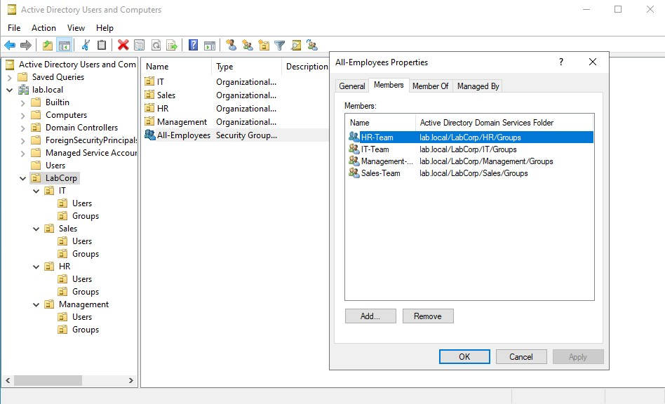

# Active Directory - Users and Groups Management

## Purpose

Learn how to populate your new domain with **Organizational Units (OUs)**, **users**, and **groups**. This is where Active Directory starts to become useful - creating the digital identities that represent people and resources in your lab.

## Prerequisites

- Domain Controller installed and running (`DC01`)
- Logged in as domain administrator (`LAB\Administrator`)
- Active Directory Users and Computers tool available

> **If you havent completed the [AD installation](./ad-installation.md), go back and do it first!** This guide builds on that setup.

---

## 1. Understanding OUs, Users, and Groups

Before we start clicking, let's understand what we're creating:

### 🗂️ **Organizational Units (OUs)**
- **What they are**: Like folders in a file system, but for AD objects
- **Why use them**: To organize users/computers by department, location, or function
- **Real world example**: "Sales", "IT", "HR", "Managers"
- **Superpower**: You can apply different policies to different OUs

### 👤 **Users**
- **What they are**: Digital identities for people (or service accounts)
- **What they store**: Username, password, name, email, department, etc.

### 👥 **Groups**
- **What they are**: Collections of users (or computers)
- **Why use them**: To assign permissions to multiple people at once
- **Superpower**: Instead of giving 20 users access to a folder, give it to one group

### 📊 **Visual Hierarchy Example**
```cmd
lab.local
├── Users (default container)
├── Computers (default container)
├── Domain Controllers (default container)
├── OUR_CUSTOM_OUs 👈
│ ├── IT
│ │ ├── Users
│ │ │ ├── carlos.tech
│ │ │ └── ana.sysadmin
│ │ └── Groups
│ │ └── IT-Admins
│ ├── Sales
│ │ ├── Users
│ │ │ ├── maria.sales
│ │ │ └── joao.vendas
│ │ └── Groups
│ │ └── Sales-Team
│ └── HR
│ ├── Users
│ │ └── patricia.hr
│ └── Groups
│ └── HR-Team
```

---

## 2. Creating Organizational Units (OUs)

### Step 2.1: Open Active Directory Users and Computers

1. On your Domain Controller (`DC01`), open **Server Manager** (should be already Server Manager > Dashboard on the top)
2. Click **Tools** -> **Active Directory Users and Computers**
3. Your domain `lab.local` should be visible

### Step 2.2: Create your first OU

Let's create a structure for a fictional company called "LabCorp":

1. **Right-click** on `lab.local`
2. Select **New** -> **Organizational Unit**
3. **Uncheck** "Protect container from accidental deletion" (for lab only - in production should be checked)
4. **Name:** `LabCorp` (this will be our top-level OU)
5. Click **OK**

> **Why uncheck protection?**
> In a lab, we might delete things often. In production, this protection prevents accidental deletion of critical OUs.

### Step 2.3: Create department OUs

Now create sub-OUs inside `LabCorp`:

1. **Right-Click** `LabCorp` -> **New** -> **Organizational Unit** (*Again, no protection prevention*)
2. **Name:** `IT`
3. Repeat for:
    - `Sales`
    - `HR`
    - `Management`

### Step 2.4: Create user and group folders inside each department

Inside each department OU, create two more OUs:

Example for IT:
1. **Right-click** `IT` -> **New** -> **Organizational Unit** -> **Name:** -> `Users`
2. **Right-click** `IT` -> **New** -> **Organizational Unit** -> **Name:** -> `Groups`

*Repeat for Sales, HR and Management.*

> **Why separate Users and Groups OUs?**
> It keeps things organizad. When you have 100 users and 20 groups, you'll thank yourself.

---

## 3. Creating Users 👤

Now let's populate our OUs with some test users.

### Step 3.1: Crate a user in IT

1. Navigate to `LabCorp` -> `IT` -> `Users`
2. **Right-click** on the `User` OU -> **New** -> **User**
3. Fill in:
    - **First name:** `Carlos`
    - **Last name:** `Silva`
    - **User logon name:** `carlos.silva` (this is what they'll type to log in)
4. Click **Next**
5. Set a **password** (e.g., `P@ssw0rd123`)
    - **Options:**
    - [ ] User must change password at next logon (uncheck for lab)
    - [X] Password never expires (check for lab - avoids password headaches)
6. Click **Next** -> **Finish**

### Step 3.2: Create more test users

Repeat for:
- IT: `rui.pereira`
- Sales: `maria.santos`
- HR: `patricia.lima`
- Management: `ricardo.ceo`

### Step 3.3: Understanding user properties

Double-click any user to explore:

- **General**: Name, display name, description
- **Account**: Logon hours, account options
- **Member Of**: Which groups this user belongs to
- **Profile**: Profile path, home folder

> **Take a momento to explore** - this is where the power of AD lives!

---

## 4. Creating Groups 👥

Groups make permission management easier.

### Step 4.1: Create a group in IT

1. Navigate to `LabCorp` -> `IT` -> `Groups`
2. **Right-click** -> **New** -> **Group**
3. Fill in:
    - **Group name:** `IT-Team`
    - **Group scope:** `Global` (most common for organizing users)
    - **Group type:** `Security` (used for permissions)
4. Click **OK**

### Step 4.2: Create more groups

- `Sales-Team` (in Sales/Groups)
- `HR-Team` (in HR/Groups)
- `Management-Team` (in Management/Groups)
- `All-Employees` (in LabCorp - top level)

### Step 4.3: Add users to groups

Let's add Carlos to the IT-Team:

1. Double-click the **`IT-Team`** group
2. Go to the **Members** tab
3. Click **Add** 
4. Type `carlos.silva` -> **Check Names** -> **OK**
5. Add `rui.pereira`
6. Click **OK**

Repeat for other groups:
- Sales-Team -> `maria.santos`
- HR-Team -> `patricia.lima` 
- Management-Team -> `ricardo.ceo`
- All-Employees -> add **everyone** (*you can add groups to groups*)

### Step 4.4: Group nesting

Groups can contain other groups.

1. Create a group called `IT-Admins` in IT/Groups
2. Add `carlos.silva` and `rui.pereira` to it
3. Now add the `IT-Admins` group to a higher-level group like `All-Employees`

> **Why nesting?**
> It simplifies managament. You give permission to `IT-Admins`, and anyone in that group inherits them.

### Visual Example: All-Employees Group Structure



*Figure: The All-Employees group containing all department teams (HR-Team, IT-Team, Management-Team, Sales-Team)*

**What you're seeing:**
- **HR-Team** → `lab.local/LabCorp/HR/Groups`
- **IT-Team** → `lab.local/LabCorp/IT/Groups`
- **Management-Team** → `lab.local/LabCorp/Management/Groups`
- **Sales-Team** → `lab.local/LabCorp/Sales/Groups`

This is **group nesting** - instead of adding 20 individual users to All-Employees, we just add 4 groups! 🎯

---

## 5. Testing What You've Created

### Test 1: Verify users exist

```powershell
# In Powershell as admin
Get-ADUser -Filter * -SearchBase "OU=IT,OU=LabCorp,DC=lab,DC=local" | Format-Table Name, SamAccountName
```

### Test 2: Verify groups

```powershell
# List all groups
Get-AdGroup -Filter * | Format-Table Name, GroupScope

# See members of IT-Team
Get-ADGroupMember -Identity "IT-Team" | Format-Table Name, SamAccountName
``` 

### Test 3: Check group membership for a user
```powershell
# Sell al groups Carlos belongs to
Get-ADUser -Identity "carlos.silva" -Properties MemberOf |
    Select-Object -ExpandProperty MemberOf |
    Get-ADGroup | Format-Table Name
```

---

## 6. Common Tasks & Useful Commands 📝

### PowerShell Cheat Sheet

| Task | Command |
|------|---------|
| Create new OU | `New-ADOrganizationalUnit -Name "NewOU" -Path "DC=lab,DC=local"` |
| Create new user | `New-ADUser -Name "Joao" -SamAccountName "joao" -UserPrincipalName "joao@lab.local" -Enabled $true -AccountPassword (ConvertTo-SecureString "P@ssw0rd" -AsPlainText -Force)` |
| Create new group | `New-ADGroup -Name "NewGroup" -GroupScope Global -Path "OU=Groups,DC=lab,DC=local"` |
| Add user to group | `Add-ADGroupMember -Identity "IT-Team" -Members "carlos.silva"` |
| List all users | `Get-ADUser -Filter * -Properties * \| Format-Table Name, SamAccountName` |

---

## 8. Next Steps 🚀

Now that your domain has users and groups, it's time to put them to work:

| Document | What you'll do |
|----------|----------------|
| [`ad-join-windows-client.md`](./ad-join-windows-client.md) | Join a Windows 10 VM to the domain and log in as one of these users |
| [`ad-group-policy.md`](./ad-group-policy.md) | Apply policies (like wallpaper, security settings) to specific OUs |
| [`ad-integration-wazuh.md`](./ad-integration-wazuh.md) | Monitor when users are created/deleted using Wazuh |