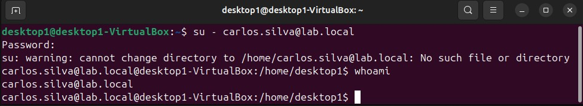

# Linux Integration with Active Directory

## Objetctive
Join an Ubuntu 22.04 VM to the Windows domain `lab.local` to enable centralized authentication for Linux endpoints. This allows domain users (e.g., `carlos.silva`) to log into the Linux machine using their Active Directory credentials, eliminating the need for local accounts.

## Prerequisites
- Domain Controller running (`DC01`, IP `192.168.200.10`)
- Ubuntu VM with network connectivity to the DC
- DNS configured to point to the DC

---

## Steps Performed

### 1. Configure DNS on Ubuntu VM

**Why:** For the Ubuntu VM to discover the domain controller and resolve domain names (e.g., `lab.local`, `dc01.lab.local`), it must use the DC as its DNS server. This is essential for both domain join and Kerberos authentication.

Edited `/etc/netplan/01-network-manager-all.yaml` :

```yaml
network:
  version: 2
  renderer: NetworkManager
  ethernets:
    enp0s3:
      addresses:
      - "192.168.200.3/24"
      dhcp4: false
      gateway4: 192.168.200.1
      nameservers:
        addresses:
        - 192.168.200.10
        search:
        - lab.local

```

**Explanation of changes:**
- `gateway4: 192.168.200.1` - default route (laptop acting as gateway)
- `nameservers.addresses: 192.168.200.10` - DNS points to the DC
- `search: lab.local` - allows using `dc01` instead of `dc01.lab.local`

Applied configuration:

```bash
sudo netplan apply 
```

**Verification:**
```bash
nslookup lab.local
``` 

---

### 2. Install Required Packages

**Why:** These packages provide the tools needed to join a Linux machine to an Active Directory domain:

- `realmd` – discovers and joins domains
- `sssd` – caches domain user information for offline login
- `adcli` – interacts directly with AD (used by realmd)
- `krb5-user` – provides Kerberos authentication utilities

```bash
sudo apt update
sudo apt install realmd sssd sssd-tools adcli krb5-user
```

---

### 3. Join the Domain

**Why**: The `realm join` command automates the domain join process: it creates the computer object in AD, configures Kerberos, and sets up SSSD.

```bash
sudo realm join -U administrator lab.local
```

**Parameters**:
- `-U administrator` – uses the domain administrator account for authentication
- `lab.local` – the domain to join

Password: `[administrator password]`


**Verify Domain Membership: **
```bash
realm list
```

---

### 4. Test Kerberos Authentication

**Why**: Kerberos is the authentication protocol used by AD. Testing `kinit` confirms that the VM can obtain a ticket from the KDC (Key Distribution Center) running on the DC.

```bash
kinit administrator@LAB.LOCAL
# Password: [administrator password]
klist
# Should show a Kerberos ticket
```

---

### 5. Test Login with Domain User

**Why**: This confirms that the integration works end-to-end – a domain user can authenticate and access the Linux system.

```bash
su - carlos.silva@lab.local
```



*Figure: Testing AD authentication - carlos.silva@lab.local successfully logged in*

**What you're seeing:**
- Command: `su - carlos.silva@lab.local`
- Warning: Home directory doesn't exist yet (expected for first login)
- Verification: `whoami` returns `carlos.silva@lab.local`
- User is authenticated via Active Directory

---

## Verification Commands

| Command | Purpose |
| `ping 192.168.200.10` | Test connectivity do DC |
| `nslookup lab.local` | Verify DNS resolution |
| `kinit administrator@LAB.LOCAL` | Test Kerberos authentication |
| `klist` | Show active Kerberos tickets | 
| `realm list` | Show domain membership status |
| `getent passwd carlos.silva@lab.local` | Verify user exists in AD |

---

## Lessons Learned

1. **DNS is critical** – The Linux VM must use the Domain Controller as its DNS server. Without proper DNS, domain discovery fails.
2. **Kerberos requires time sync**  – Time difference between Linux and the DC must be less than 5 minutes, otherwise Kerberos authentication fails.
3. **First login creates home directory** – When a domain user logs in for the first time, `pam_mkhomedir` (or similar) creates the home directory automatically.
4. `realm join` **automates complexity** – It handles Kerberos configuration, SSSD setup, and AD computer object creation in a single command.
