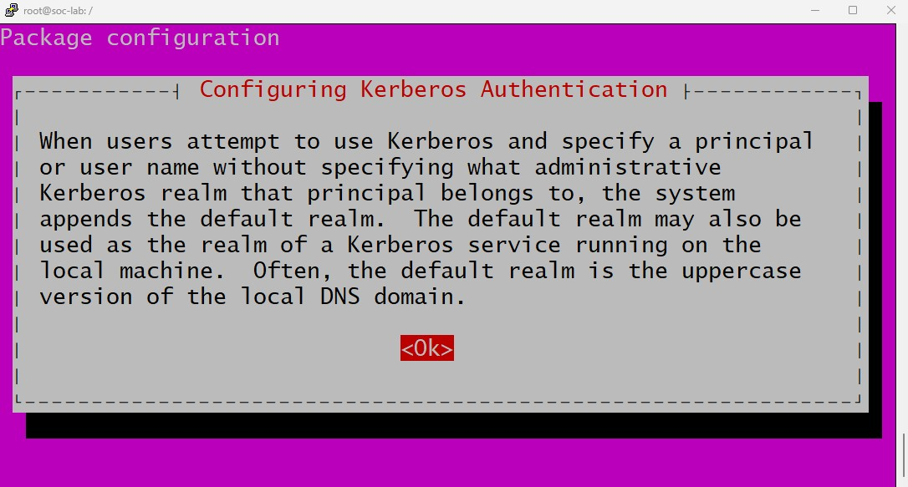
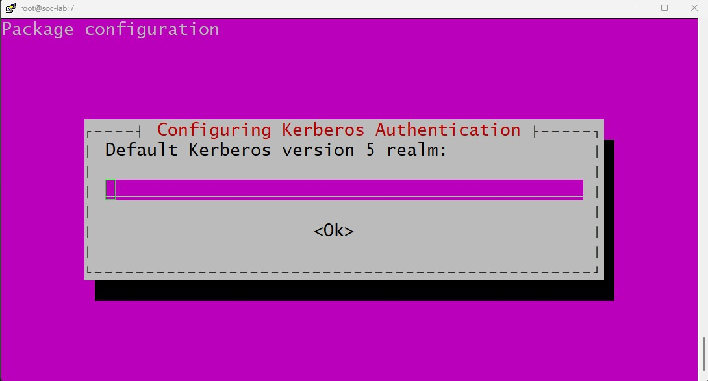
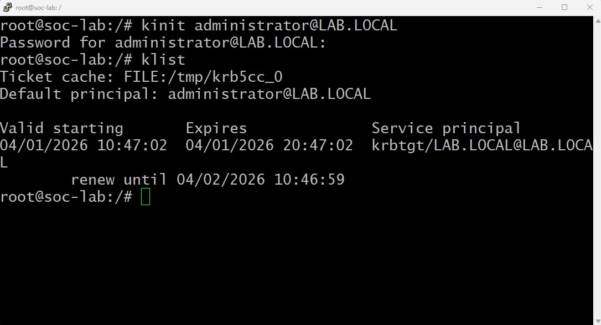
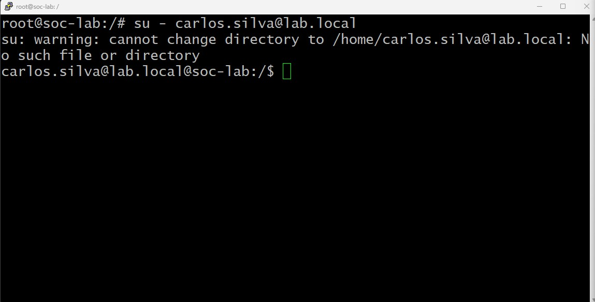

# Ubuntu Server Integration with Active Directory

## Objective
Join the physical Ubuntu Server (`192.168.200.2`) to the `lab.local` domain to enable centralized authentication and management.

## Prerequisites
- Domain Controller (`DC01`, IP `192.168.200.10`)
- Ubuntu Server with network connectivity to the DC
- DNS configured to point to the DC

---

## 1. Configure DNS on Ubuntu Server

**Current problem:** The server cannot resolve `dc01.lab.local`.

**Solution:** Edit `/etc/netplan/00-installer-config.yaml` to add the DC as a name server.

> **Note:** The filename may vary. Use `ls /etc/netplan` to confirm.

```bash
root@soc-lab:/# cat /etc/netplan/00-installer-config.yaml
network:
  version: 2
  renderer: networkd
  wifis:
     wlo1:
       dhcp4: yes
       access-points:
         "#network-name":
           password: "#password-name"

  ethernets:
    eno1:
      dhcp4: no
      addresses:
        - 192.168.200.2/24
      nameservers:                      # Section that defines DNS configuration
        addresses: [192.168.200.10]     # IP of The Domain Controller (acts as DNS server)
        search: [lab.local]             # DNS search domain for automatic suffix appending
```

After editing the file, apply netplan configuration:
```bash
# Validate netplan configuration before applying (optional)
sudo netplan try

# if no errors, apply permanently
sudo netplan apply

# Verify DNS resolution
nslookup lab.local
nslookup dc01.lab.local

# Test connectivity
ping dc01.lab.local
``` 

## 2. Install Required Packages
`realmd`, `sssd`, `adcli`, `krb5-user`

```bash
sudo apt update
sudo apt install realmd sssd sssd-tools adcli krb5-user packagekit -y
```


*Kerberos authentication explanation — The system explains that the default realm is appended to usernames when not specified. The realm is typically the uppercase version of the DNS domain.*


*Default Kerberos realm configuration — Enter the realm in uppercase format: `LAB.LOCAL` (not `lab.local`). This must match the Active Directory domain name in uppercase.*

> **Important:** The Kerberos realm must be entered in **uppercase** (`LAB.LOCAL`), even though your DNS domain is lowercase (`lab.local`). This is a Kerberos convention.

## 3. Join the Domain
```bash
sudo realm join -U administrator lab.local
```

## 4. Test Kerberos Authentication
```bash
kinit administrator@LAB.LOCAL
# Password: [administrator password]
klist
# Should show a Kerberos ticket
```


*Successful Kerberos authentication test - The `kinit` command obtain a TGT (Ticket Granting Ticket) from the KDC. The `klist` command shows the ticket is valid for 10 hours (default) and can be renewed for 1 day*

**What to verify:**
- `Default principal: administrator@LAB.LOCAL` - Correct user and realm
- `Valid starting` / `Expires` - Ticket is valid (default: 10 hours)
- `Service principal: krbtgt/LAB.LOCAL@LAB.LOCAL` - TGT for the domain
- `renew until` - Ticket can be renewed for up to 1 day

**Troubleshooting:**
| **Issue** | **Possible Cause** |
| - | - |
| `Cannot find KDC for realm` | DNS not configured correctly; verify `/etc/netplan` |
| `Password incorrect` | Wrong password or account locked in AD |
| `Clock skew too great` | Time difference > 5 minutes between Ubuntu and DC; run `sudo timedatectl set-ntp true` |

## 5. Verify Login with Domain User
```bash
su - carlos.silva@lab.local
```


*Successfull Active Directory authentication on Ubuntu - The `su` command authenticates `carlos.silva@lab.local` against the domain controller. The warning about the home directory is normal on first login; it will be auto-created after configuring `pam-auth-update`*

**What this confirms:**
- ✅ SSSD is correctly resolving AD users
- ✅ Kerberos authentication is working
- ✅ The user can log in (shell access granted)
- ⚠️ Home directory doesnt exist yet (expected before `pam-auth-update`)

## 6. Configure Automatic Home Directory Creation
